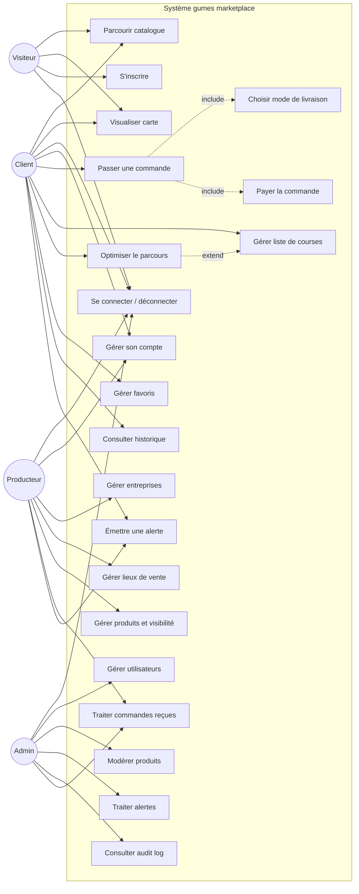

# DL1 — §2 Cas d'utilisation & §3 Scénarios

**Application :** gumes marketplace — **Équipe :** les gumes
**Date :** 2026-04-20 — **Livrable :** DL1 (2026-04-22 12h)

---

## §2.1 Acteurs

| Acteur | Description | Authentifié |
|---|---|---|
| **Visiteur** | Internaute non connecté qui découvre l'offre avant de créer un compte. | Non |
| **Client** (`user`) | Achète des produits locaux, constitue listes de courses et favoris, suit ses commandes. | Oui |
| **Producteur** (`seller`) | Gère ses entreprises, lieux de vente, produits et les commandes reçues. | Oui |
| **Super-administrateur** (`admin`) | Supervise la plateforme : utilisateurs, modération produits, alertes, audit. | Oui |

> **Note héritage :** `admin` hérite de tous les droits `seller` + `user`. `seller` et `user` sont disjoints fonctionnellement (pas d'héritage réciproque), mais un même humain peut posséder deux comptes distincts.

---

## §2.2 Diagramme de cas d'utilisation (UML, rendu Mermaid)

---

## §2.3 Cas d'utilisation par acteur (liste textuelle)

### Visiteur

| ID | Cas d'utilisation | Pré-condition | Post-condition |
|---|---|---|---|
| UC-V-01 | Parcourir le catalogue public | — | Aucun effet persistant |
| UC-V-02 | Visualiser les lieux de vente sur une carte | — | — |
| UC-V-03 | Consulter une fiche produit / producteur | — | — |
| UC-V-04 | Créer un compte (client **ou** producteur) | Email non déjà utilisé | Compte créé, utilisateur connecté |
| UC-V-05 | Se connecter | Compte existant | Session ouverte |

### Client (`user`)

| ID | Cas d'utilisation | Pré-condition | Post-condition |
|---|---|---|---|
| UC-C-01 | Modifier son profil | Connecté | Profil à jour |
| UC-C-02 | Se désinscrire (anonymisation) | Connecté | Compte anonymisé, session fermée |
| UC-C-03 | Ajouter un produit au panier | Stock disponible | Panier mis à jour |
| UC-C-04 | Passer une commande | Panier non vide | Commande créée, statut `pending` |
| UC-C-05 | Choisir le mode de livraison | Panier non vide | Frais de port calculés |
| UC-C-06 | Payer (simulation) | Commande créée | Paiement `success` / `declined` / `error` |
| UC-C-07 | Constituer une liste de courses | Connecté | Liste persistée |
| UC-C-08 | Optimiser le parcours de sa liste de courses | Liste ≥ 2 produits géolocalisés | Itinéraire proposé |
| UC-C-09 | Ajouter / retirer un vendeur des favoris | Connecté | Favoris à jour |
| UC-C-10 | Consulter l'historique de **ses** commandes | Connecté | — |
| UC-C-11 | Émettre une alerte de dysfonctionnement | Connecté | Alerte créée, statut `open` |

### Producteur (`seller`)

| ID | Cas d'utilisation | Pré-condition | Post-condition |
|---|---|---|---|
| UC-P-01 | Modifier son profil | Connecté | Profil à jour |
| UC-P-02 | Se désinscrire | Aucune commande en cours | Compte anonymisé |
| UC-P-03 | CRUD ses entreprises | Connecté, rôle `seller` | Entreprise(s) à jour |
| UC-P-04 | CRUD ses lieux de vente + horaires | Entreprise existante | Lieu(x) à jour |
| UC-P-05 | CRUD ses produits (nom, bio, prix, stock, saison, `shippable`) | Entreprise existante | Produit(s) à jour |
| UC-P-06 | Gérer la visibilité d'un produit (saison / stock / masqué) | Produit existant | Visibilité mise à jour |
| UC-P-07 | Consulter les commandes reçues (ses produits uniquement) | Connecté | — |
| UC-P-08 | Accepter / refuser une commande | Commande `pending` sur ses produits | Statut → `accepted` / `refused` |
| UC-P-09 | Passer une commande au statut `preparing` / `ready_for_pickup` / `shipped` | Commande `accepted` | Statut mis à jour |
| UC-P-10 | Émettre une alerte | Connecté | Alerte créée |

### Super-administrateur (`admin`)

| ID | Cas d'utilisation | Pré-condition | Post-condition |
|---|---|---|---|
| UC-A-01 | Consulter le dashboard global | Connecté `admin` | — |
| UC-A-02 | CRUD utilisateurs (promouvoir / rétrograder / désactiver) | — | Utilisateur(s) à jour, entrée `audit_log` |
| UC-A-03 | Modérer un produit (forcer `hidden`) | Produit existant | Produit masqué, entrée `audit_log` |
| UC-A-04 | Traiter / clôturer une alerte | Alerte `open` | Alerte `closed`, entrée `audit_log` |
| UC-A-05 | Consulter l'audit log | — | — |
| UC-A-06 | Rembourser une commande annulée | Paiement `success`, commande `cancelled` | Paiement `refunded`, entrée `audit_log` |

---

## §3 Scénarios (nominaux + erreurs — ≥ 2 par rôle)

Les scénarios ci-dessous précisent les interactions pas à pas. Format : **contexte → étapes → résultat**.

### 3.1 Visiteur

#### VIS-NOM-01 — Inscription réussie d'un client (nominal)
1. Le visiteur accède à `/register`.
2. Il saisit email, mot de passe (≥ 10 car.), nom, rôle `client`.
3. Le front valide en direct (zod côté client), envoie `POST /api/auth/register`.
4. Le serveur vérifie l'unicité, hache le mot de passe (argon2), crée l'utilisateur, ouvre une session.
5. **Résultat :** redirection vers `/app/home`, toast de bienvenue.

#### VIS-ERR-01 — Email déjà utilisé (erreur)
1. Étapes 1–3 identiques à VIS-NOM-01.
2. Le serveur détecte un doublon → `409 Conflict` (temps constant pour ne pas révéler l'existence).
3. **Résultat :** message « Un compte existe déjà avec cet email. » + lien « Mot de passe oublié ? ». Rate-limit incrémenté.

#### VIS-ERR-02 — Rate-limit atteint sur `/login`
1. Le visiteur tente 6 connexions erronées en 60 s.
2. À la 6ᵉ tentative, `express-rate-limit` renvoie `429 Too Many Requests`.
3. **Résultat :** message « Trop de tentatives, réessayez dans X secondes ». Les tentatives suivantes sont bloquées jusqu'à expiration de la fenêtre.

### 3.2 Client

#### CLI-NOM-01 — Commande avec retrait en lieu de vente et paiement simulé (nominal)
1. Client connecté ajoute 3 produits du **même** lieu de vente au panier.
2. `POST /api/commandes/quote` renvoie les 3 modes dispo ; le client choisit `pickup_store` (0 €).
3. Il clique « Payer », saisit `4242 4242 4242 4242` / `12/29` / `123` dans `<FakeCardForm>`.
4. `POST /api/paiements` avec `Idempotency-Key` : délai 1,5 s simulé → `success`.
5. Transaction PG : création commande (`pending`) + paiement (`success`) + décrément stock dans un `BEGIN…COMMIT`.
6. **Résultat :** toast « Commande confirmée », redirection vers `/app/commandes/:id`, badge « Paiement simulé ».

#### CLI-NOM-02 — Optimisation de parcours d'une liste de courses (nominal)
1. Le client a une liste de 5 produits répartis sur 4 lieux de vente.
2. Il clique « Optimiser mon parcours » depuis `/app/liste-courses`.
3. Un Web Worker exécute l'algorithme nearest-neighbor + 2-opt sur les coordonnées géocodées.
4. Le serveur (PostGIS) retourne les distances, le Worker ordonne les étapes.
5. **Résultat :** itinéraire affiché sur la carte Leaflet avec numérotation 1→4, distance totale et durée estimée.

#### CLI-ERR-01 — Paiement refusé (carte `...0000`)
1. Étapes 1–3 de CLI-NOM-01, mais numéro `4242 4242 4242 0000`.
2. `POST /api/paiements` → `declined` après 1,5 s.
3. `ROLLBACK` PG : commande **non** créée, stock **non** décrémenté.
4. **Résultat :** toast d'erreur « Paiement refusé par la banque — aucune commande n'a été enregistrée. » Retour sur l'écran de paiement avec panier intact.

#### CLI-ERR-02 — Livraison à domicile indisponible (produit non `shippable`)
1. Le panier contient un produit dont `shippable = false` (ex. fromage frais local).
2. `POST /api/commandes/quote` renvoie les modes : `pickup_store` et `pickup_relay` actifs, `home_delivery` **grisé** avec raison `« Un produit de ce panier ne peut pas être expédié. »`.
3. **Résultat :** le client choisit un autre mode ; la règle métier est explicite et non bloquante.

#### CLI-ERR-03 — Accès interdit à `/admin` (erreur d'autorisation)
1. Le client, connecté en `user`, saisit `/admin` dans la barre d'URL.
2. `requireRole('admin')` bloque → `403 Forbidden`.
3. **Résultat :** page d'erreur 403 avec lien « Retour à l'accueil ». Tentative tracée dans `audit_log` (niveau `warn`).

### 3.3 Producteur

#### PRO-NOM-01 — Ajout d'un produit saisonnier (nominal)
1. Producteur connecté va dans `/seller/produits/new`.
2. Il saisit nom, nature, prix, stock, coche `bio` et `shippable`, sélectionne le lieu de vente, coche la saisonnalité « avril–juin ».
3. `POST /api/produits` (zod valide, `owner_id` = session) → `201 Created`.
4. **Résultat :** toast « Produit créé », redirection vers la fiche. Le produit est visible côté client uniquement si la date courante est dans la saison ET stock > 0.

#### PRO-NOM-02 — Acceptation d'une commande (nominal)
1. Producteur reçoit une commande `pending` (badge rouge dans `/seller/commandes`).
2. Il clique « Accepter », un `ConfirmDialog` demande confirmation.
3. `PATCH /api/commandes/:id` avec `{ statut: "accepted" }`.
4. Middleware vérifie que **tous les articles** de la commande appartiennent bien à ce producteur (sinon 403).
5. **Résultat :** statut mis à jour, toast côté producteur, notification côté client (via historique + email simulé).

#### PRO-ERR-01 — Tentative de modification d'un produit d'un autre producteur
1. Producteur B tente `PATCH /api/produits/42` où le produit 42 appartient au producteur A.
2. Le contrôleur vérifie `produit.owner_id === req.session.user.id` → faux.
3. **Résultat :** `403 Forbidden`, entrée dans `audit_log` avec `level=warn`, `action=unauthorized_edit_attempt`.

#### PRO-ERR-02 — Désinscription bloquée par commandes en cours
1. Producteur clique « Supprimer mon compte » dans `/seller/profil`.
2. `DELETE /api/users/me` vérifie : commandes `pending`/`accepted`/`preparing` sur ses produits ?
3. Oui → `409 Conflict` avec message « 3 commandes sont en cours, vous ne pouvez pas vous désinscrire maintenant. »
4. **Résultat :** l'utilisateur reste connecté, liste des commandes bloquantes affichée.

### 3.4 Super-administrateur

#### ADM-NOM-01 — Modération d'un produit signalé (nominal)
1. Admin consulte `/admin/alertes` et voit une alerte pointant vers le produit 17.
2. Il ouvre la fiche, clique « Masquer ce produit ».
3. `PATCH /api/produits/17 { visibilite: "hidden" }` (rôle `admin` autorisé à contourner la règle `owner_id`).
4. Écriture `audit_log` : `actor=admin@gumes.local`, `action=force_hide`, `target=produit:17`.
5. **Résultat :** produit disparaît du catalogue client, producteur reçoit une notification.

#### ADM-NOM-02 — Promotion d'un utilisateur `user` → `seller` (nominal)
1. Admin dans `/admin/users`, filtre sur `user`, sélectionne Jean Dupont.
2. Clique « Promouvoir producteur », `ConfirmDialog`.
3. `PATCH /api/users/42 { role: "seller" }` → écriture `audit_log`.
4. **Résultat :** Jean voit à sa prochaine connexion le menu `seller` et peut créer une entreprise.

#### ADM-ERR-01 — Tentative d'auto-rétrogradation
1. Admin clique « Changer mon rôle en `user` » sur son propre profil.
2. Le back refuse : règle `admin ne peut pas modifier son propre rôle` → `409 Conflict`.
3. **Résultat :** message « Impossible de modifier son propre rôle. Demandez à un autre administrateur. » Évite les blocages (plus aucun admin).

#### ADM-ERR-02 — Remboursement d'une commande déjà remboursée (idempotence)
1. Admin clique deux fois rapidement sur « Rembourser ».
2. Le 2ᵉ appel détecte `paiement.status === 'refunded'` → `409 Conflict` avec message explicite.
3. **Résultat :** pas de double remboursement, `audit_log` trace la tentative.

---

## Traçabilité — cas d'utilisation ↔ sections du rapport

| UC | Couvert par | Vue SQL associée (prévue §7) |
|---|---|---|
| UC-C-04, UC-P-07, UC-P-08 | §4c (livraison), §4d (paiement), §5 (API /commandes) | `v_commandes_detaillees` |
| UC-C-10 | §5 (/api/historique) | `v_historique_client` |
| UC-P-06, UC-V-01 | §9 visibilité produits | `v_produits_disponibles` |
| UC-C-08 | §10 (algo), §6 (Web Worker) | — |
| UC-A-05 | §4b sécurité | `v_audit_recent` |

---

*Document rédigé collectivement par l'équipe les gumes — 2026-04-20.*
