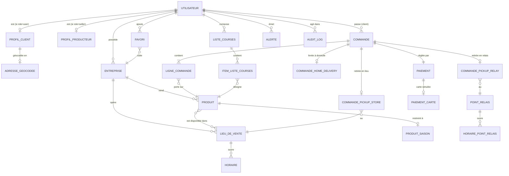

# DL1 — §5 Modèle conceptuel & §6 Schéma logique

## Principes directeurs

1. **Minimiser les NULL** (exigence explicite du PDF) → tables filles plutôt que colonnes nullables pour les attributs optionnels conditionnels.
2. **Intégrité référentielle forte** : toutes les FK avec `ON DELETE` explicite.
3. **Argent en entiers (centimes)** — jamais `FLOAT` ni `REAL` pour les prix.
4. **Temps en `TIMESTAMPTZ`** (UTC stocké, rendu FR côté UI).
5. **Géolocalisation en `geography(Point, 4326)`** + index GIST pour toutes les requêtes de proximité.
6. **Pas d'ENUM PG** : on utilise des contraintes `CHECK (col IN (…))` + `DOMAIN` — plus simple à faire évoluer que les `CREATE TYPE … AS ENUM` qui exigent `ALTER TYPE`.

---

## §5 MCD (diagramme entité-association)

Rendu Mermaid. Cardinalités en notation Merise (0,1 / 0,n / 1,1 / 1,n).



### Règles de gestion (RG)

| Code | Règle | Appliquée par |
|---|---|---|
| RG-01 | Un utilisateur a **un rôle et un seul** à un instant donné. | `utilisateur.role CHECK (role IN ('admin','seller','user'))` |
| RG-02 | `profil_client` existe ⇔ `role='user'`. Idem `profil_producteur` ⇔ `role='seller'`. | Trigger PG ou validation applicative à l'inscription. |
| RG-03 | Un `admin` n'a ni profil client ni profil producteur (superviseur hors marketplace). | Trigger. |
| RG-04 | Une commande n'a **qu'un seul** mode de livraison → au plus **une** ligne dans `commande_pickup_store` / `commande_pickup_relay` / `commande_home_delivery`. | Trigger `CHECK` cross-table + contrainte applicative. |
| RG-05 | Mode `pickup_store` possible **uniquement** si tous les produits de la commande proviennent du même `lieu_de_vente`. | Vérifié à `POST /api/commandes/quote`. |
| RG-06 | Mode `home_delivery` impossible si **un seul** produit a `shippable=false`. | Idem. |
| RG-07 | Un produit n'est vendu **que** dans des lieux de vente de **sa propre entreprise**. | FK composite + CHECK : `produit.entreprise_id = lieu_de_vente.entreprise_id`. |
| RG-08 | `paiement` est unique par commande (1..1). | `UNIQUE(commande_id)` + FK. |
| RG-09 | `ligne_commande.prix_unitaire_cents` est un **snapshot** figé à la création — jamais recalculé. | Contrôle applicatif, jamais de trigger de mise à jour. |
| RG-10 | `produit.est_saisonnier=true` ⇔ une ligne existe dans `produit_saison`. | Trigger. |
| RG-11 | `favori` est unique sur `(client_id, entreprise_id)`. | PK composite. |
| RG-12 | Désinscription d'un seller bloquée s'il a des commandes dans `{pending, accepted, preparing}`. | Vérifié côté service avant `UPDATE utilisateur SET deleted_at = NOW()`. |
| RG-13 | Un admin ne peut pas modifier son propre rôle. | Vérifié côté service + test e2e. |

---

## §6 Schéma logique (tables, clés, contraintes)

Notation : **`PK`** primary key · *`FK`* foreign key · `UQ` unique · `IX` index · `CK` check · `NN` NOT NULL · `DF` default.

### 6.1 Authentification & profils

```
utilisateur
├── id                 UUID       PK  DF gen_random_uuid()
├── email              CITEXT     NN  UQ
├── password_hash      TEXT       NN                       -- argon2id
├── role               TEXT       NN  CK IN ('admin','seller','user')
├── created_at         TIMESTAMPTZ NN DF NOW()
├── deleted_at         TIMESTAMPTZ                         -- anonymisation RGPD
└── last_login_at      TIMESTAMPTZ

profil_client                                              -- 0..1 utilisateur
├── user_id            UUID       PK  FK → utilisateur(id) ON DELETE CASCADE
├── nom                TEXT       NN
├── prenom             TEXT       NN
├── tel                TEXT       NN  CK regex ^\+?[0-9 .-]{10,20}$
└── adresse            TEXT       NN

adresse_geocodee                                           -- 0..1 profil_client (séparé pour éviter NULL lat/lon si géocodage en attente)
├── user_id            UUID       PK  FK → profil_client(user_id) ON DELETE CASCADE
├── lat                DOUBLE     NN  CK BETWEEN -90 AND 90
├── lon                DOUBLE     NN  CK BETWEEN -180 AND 180
├── geom               geography(Point,4326)  NN           -- généré, IX GIST
└── geocoded_at        TIMESTAMPTZ NN DF NOW()

profil_producteur                                          -- 0..1 utilisateur
├── user_id            UUID       PK  FK → utilisateur(id) ON DELETE CASCADE
├── nom                TEXT       NN
├── prenom             TEXT       NN
└── tel                TEXT       NN
```

### 6.2 Entreprises, lieux, horaires

```
entreprise
├── id                 UUID       PK  DF gen_random_uuid()
├── owner_id           UUID       NN  FK → utilisateur(id) ON DELETE RESTRICT
├── nom                TEXT       NN
├── siret              TEXT       NN  UQ  CK regex ^[0-9]{14}$
├── description        TEXT       NN  DF ''
└── created_at         TIMESTAMPTZ NN DF NOW()
                       IX owner_id

lieu_de_vente
├── id                 UUID       PK
├── entreprise_id      UUID       NN  FK → entreprise(id) ON DELETE CASCADE
├── nom                TEXT       NN
├── adresse            TEXT       NN
├── lat, lon           DOUBLE     NN
├── geom               geography(Point,4326) NN     -- IX GIST
└── actif              BOOL       NN  DF TRUE
                       UQ (entreprise_id, id)      -- nécessaire pour FK composite vers produit_lieu_vente (RG-07)

horaire
├── id                 SERIAL     PK
├── lieu_id            UUID       NN  FK → lieu_de_vente(id) ON DELETE CASCADE
├── jour_semaine       SMALLINT   NN  CK BETWEEN 0 AND 6    -- 0=lundi
├── heure_debut        TIME       NN
├── heure_fin          TIME       NN
└──                              CK heure_debut < heure_fin
                       IX (lieu_id, jour_semaine)

point_relais
├── id                 UUID       PK
├── nom                TEXT       NN
├── adresse            TEXT       NN
├── lat, lon           DOUBLE     NN
├── geom               geography(Point,4326) NN     -- IX GIST
└── actif              BOOL       NN  DF TRUE

horaire_point_relais                               -- même structure que horaire
```

### 6.3 Catalogue produits

```
produit
├── id                 UUID       PK
├── entreprise_id      UUID       NN  FK → entreprise(id) ON DELETE CASCADE
├── nom                TEXT       NN
├── description        TEXT       NN  DF ''
├── nature             TEXT       NN  CK IN ('legume','fruit','viande','fromage','epicerie','boisson','autre')
├── bio                BOOL       NN
├── prix_cents         INTEGER    NN  CK prix_cents >= 0
├── stock              INTEGER    NN  CK stock >= 0
├── shippable          BOOL       NN  DF FALSE
├── visibilite         TEXT       NN  CK IN ('visible','hidden','out_of_stock')  DF 'visible'
├── est_saisonnier     BOOL       NN  DF FALSE
├── created_at         TIMESTAMPTZ NN DF NOW()
└── updated_at         TIMESTAMPTZ NN DF NOW()
                       IX (entreprise_id)
                       IX (visibilite) WHERE visibilite='visible'  -- index partiel

produit_saison                                     -- 0..1 par produit (existe ssi est_saisonnier)
├── produit_id         UUID       PK  FK → produit(id) ON DELETE CASCADE
├── mois_debut         SMALLINT   NN  CK BETWEEN 1 AND 12
└── mois_fin           SMALLINT   NN  CK BETWEEN 1 AND 12
                                                  -- chevauchement possible (ex. asperges mars→mai, potimarron oct→jan)

produit_lieu_vente                                 -- N:M respectant RG-07
├── produit_id         UUID       NN  FK → produit(id) ON DELETE CASCADE
├── entreprise_id      UUID       NN                -- redondance pour FK composite
├── lieu_id            UUID       NN
└──                    PK (produit_id, lieu_id)
                       FK (entreprise_id, lieu_id) → lieu_de_vente(entreprise_id, id)  -- RG-07 : même entreprise
                       FK (produit_id, entreprise_id) → produit(id, entreprise_id)     -- idem
```

### 6.4 Commandes (éclatement par mode de livraison — pas de NULL)

```
commande
├── id                 UUID       PK
├── client_id          UUID       NN  FK → utilisateur(id) ON DELETE RESTRICT
├── statut             TEXT       NN  CK IN ('pending','accepted','refused','preparing','ready_for_pickup','shipped','delivered','cancelled')
├── mode_livraison     TEXT       NN  CK IN ('pickup_store','pickup_relay','home_delivery')
├── total_produits_cents INTEGER  NN  CK >= 0
├── frais_port_cents   INTEGER    NN  CK >= 0  DF 0
├── total_ttc_cents    INTEGER    NN  GENERATED ALWAYS AS (total_produits_cents + frais_port_cents) STORED
├── date_commande      TIMESTAMPTZ NN DF NOW()
└── updated_at         TIMESTAMPTZ NN DF NOW()
                       IX (client_id, date_commande DESC)
                       IX (statut) WHERE statut IN ('pending','accepted','preparing')  -- dashboards

ligne_commande
├── id                 SERIAL     PK
├── commande_id        UUID       NN  FK → commande(id) ON DELETE CASCADE
├── produit_id         UUID       NN  FK → produit(id) ON DELETE RESTRICT
├── quantite           INTEGER    NN  CK > 0
├── prix_unitaire_cents INTEGER   NN  CK >= 0         -- snapshot (RG-09)
└──                    UQ (commande_id, produit_id)

commande_pickup_store                                -- 0..1 par commande
├── commande_id        UUID       PK  FK → commande(id) ON DELETE CASCADE
└── lieu_id            UUID       NN  FK → lieu_de_vente(id) ON DELETE RESTRICT

commande_pickup_relay
├── commande_id        UUID       PK  FK → commande(id) ON DELETE CASCADE
└── relais_id          UUID       NN  FK → point_relais(id) ON DELETE RESTRICT

commande_home_delivery
├── commande_id        UUID       PK  FK → commande(id) ON DELETE CASCADE
├── adresse            TEXT       NN
├── lat, lon           DOUBLE     NN
└── geom               geography(Point,4326) NN

-- Trigger d'intégrité (RG-04) : une et une seule des trois sous-tables est peuplée pour chaque commande,
-- cohérente avec commande.mode_livraison.
```

### 6.5 Paiement (simulation)

```
paiement
├── id                 UUID       PK
├── commande_id        UUID       NN  UQ  FK → commande(id) ON DELETE RESTRICT
├── montant_cents      INTEGER    NN  CK >= 0
├── methode            TEXT       NN  CK IN ('card_fake','on_pickup','on_delivery')
├── statut             TEXT       NN  CK IN ('pending','success','declined','error','refunded')
├── idempotency_key    TEXT       NN  UQ
├── created_at         TIMESTAMPTZ NN DF NOW()
└── updated_at         TIMESTAMPTZ NN DF NOW()

paiement_carte                                       -- 0..1 (existe ssi methode='card_fake')
├── paiement_id        UUID       PK  FK → paiement(id) ON DELETE CASCADE
└── last4              CHAR(4)    NN  CK regex ^[0-9]{4}$
```

### 6.6 Favoris, liste de courses, alertes, audit

```
favori
├── client_id          UUID       FK → utilisateur(id) ON DELETE CASCADE
├── entreprise_id      UUID       FK → entreprise(id)  ON DELETE CASCADE
├── created_at         TIMESTAMPTZ NN DF NOW()
└──                    PK (client_id, entreprise_id)

liste_courses
├── id                 UUID       PK
├── client_id          UUID       NN  FK → utilisateur(id) ON DELETE CASCADE
├── nom                TEXT       NN  DF 'Ma liste'
└── created_at         TIMESTAMPTZ NN DF NOW()
                       IX (client_id)

item_liste_courses
├── id                 SERIAL     PK
├── liste_id           UUID       NN  FK → liste_courses(id) ON DELETE CASCADE
├── produit_id         UUID       NN  FK → produit(id) ON DELETE CASCADE
├── quantite           INTEGER    NN  CK > 0  DF 1
└──                    UQ (liste_id, produit_id)

alerte
├── id                 UUID       PK
├── emetteur_id        UUID       NN  FK → utilisateur(id) ON DELETE SET NULL  -- on garde l'alerte anonymisée
├── type               TEXT       NN  CK IN ('produit','commande','lieu_de_vente','autre')
├── cible_id           UUID                                    -- polymorphe, NULL si type='autre'
├── description        TEXT       NN
├── statut             TEXT       NN  CK IN ('open','in_progress','closed')  DF 'open'
├── resolved_at        TIMESTAMPTZ
├── resolved_by        UUID           FK → utilisateur(id)
└── created_at         TIMESTAMPTZ NN DF NOW()
                       CK (statut='closed') = (resolved_at IS NOT NULL)
                       IX (statut) WHERE statut <> 'closed'

audit_log
├── id                 BIGSERIAL  PK
├── actor_id           UUID           FK → utilisateur(id) ON DELETE SET NULL
├── action             TEXT       NN                         -- ex. 'user.promote', 'produit.force_hide'
├── target_type        TEXT                                  -- NULL pour actions sans cible (login)
├── target_id          TEXT
├── payload            JSONB      NN  DF '{}'::jsonb
├── ip                 INET
├── user_agent         TEXT
└── created_at         TIMESTAMPTZ NN DF NOW()
                       IX (actor_id, created_at DESC)
                       IX (action, created_at DESC)
```

### 6.7 Session (gérée par connect-pg-simple)

```
session                                             -- standard connect-pg-simple
├── sid                VARCHAR    PK
├── sess               JSON       NN
└── expire             TIMESTAMPTZ NN
                       IX (expire)
```

### 6.8 Référentiels statiques (seed)

```
shipping_rate                                       -- une ligne par mode
├── mode               TEXT       PK  CK IN ('pickup_store','pickup_relay','home_delivery')
├── prix_cents         INTEGER    NN                -- ex. 0 / 250 / 490
├── seuil_franco_cents INTEGER    NN  DF 0          -- 5000 pour home_delivery
└── actif              BOOL       NN  DF TRUE
```

---

## 6.9 Bilan de minimisation des NULL

| Table | Colonnes NULL autorisées | Justification |
|---|---|---|
| utilisateur | `deleted_at`, `last_login_at` | Cycle de vie (compte jamais supprimé / jamais connecté). Inévitable. |
| alerte | `cible_id`, `resolved_at`, `resolved_by` | `cible_id` NULL si type générique · `resolved_*` NULL si non résolue. CHECK croisé garantit la cohérence. |
| audit_log | `actor_id`, `target_type`, `target_id`, `ip`, `user_agent` | `actor_id` NULL après anonymisation du compte · `target_*` NULL pour événements système. |
| session | — | Pas de NULL. |

**Toutes les autres tables sont sans NULL grâce aux sous-tables** (`adresse_geocodee`, `produit_saison`, `commande_pickup_*`, `paiement_carte`).

---

## 6.10 Transactions critiques

- **Passage de commande** (`POST /api/commandes`) :
  ```
  BEGIN;
    SELECT … FOR UPDATE  -- verrouille les stocks des produits du panier
    INSERT INTO commande …
    INSERT INTO ligne_commande …           -- 1 par article
    INSERT INTO commande_pickup_store|_relay|_home_delivery …
    UPDATE produit SET stock = stock - q WHERE id = …
    INSERT INTO paiement (statut='pending', …)
  COMMIT;
  ```
  Si la simulation de paiement échoue ensuite → `UPDATE paiement SET statut='declined'` + `UPDATE commande SET statut='cancelled'` + restauration du stock dans une seconde transaction.

- **Idempotence paiement** : `INSERT … ON CONFLICT (idempotency_key) DO NOTHING RETURNING *` → si la clé existe, on renvoie le paiement déjà existant, pas de double-débit.

---

*Équipe les gumes — 2026-04-20.*
